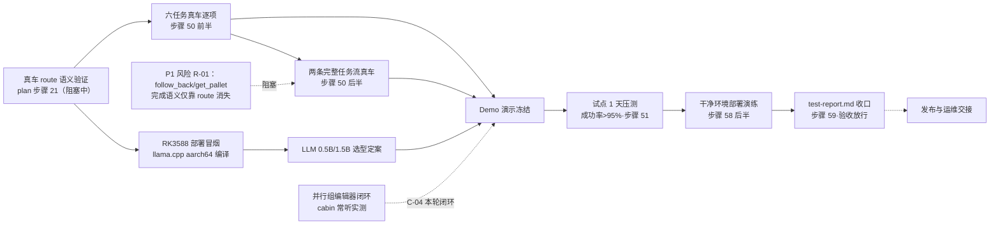

# forkAI V2 项目周期计划

| 项 | 内容 |
|---|---|
| 版本 | 1.0 |
| 日期 | 2026-08-11 |
| 状态 | 待批准生效 |
| 基线关系 | 需求以 `docs/requirements-v2.md` 为准；实施状态以 `docs/implementation-plan-v2.md` 为准；验收证据以 `docs/acceptance-v2.md` 与实际测试输出为准。本文为**周期计划基线**，不替代上述文档职能。 |
| 关联文档 | `docs/prd.md`（产品需求）、`docs/tdd.md`（技术设计）、`docs/architecture-v2.md` |

## 1. 约束与假设（已确认输入）

| # | 约束/假设 | 影响 |
|---|---|---|
| C-01 | 真车与 RK3588 随时可用，**每周现场测试≤3 天**（人员执行） | 各阶段设测试日预算；E5/E6 任务按预算排 |
| C-02 | 开发任务由 AI 完成，不占测试日，与测试日并行穿插 | 开发与现场测试并行编排 |
| C-03 | Demo 无硬性目标日期/观众 | 顺排，不倒排压缩 |
| C-04 | 并行组编辑器（R-05）与 cabin 常听实测**本轮闭环**，不降级 | 列入增量期正式任务 |
| C-05 | 总周期 12 周（W1–W12），相对周计时；用户批准本计划之日为 M0 起点 | 甘特图为相对时间 |
| C-06 | 真车测试前置记录：车型、载荷、场地、现场人员、急停、速度上限、预期动作与停止条件（AGENTS.md / jarvis-fork AGENTS.md 要求） | 每个测试日开工前必填 |
| C-07 | 低速隔离区逐级验证：先台架/HIL，再低速，再正常工况 | MVP 期入口门禁 |

## 2. 技术依赖图

依赖事实来源：`docs/tdd.md` §7.7、`docs/prd.md` §8、`implementation-plan-v2.md` 未完成步骤。



关键判断：

- **卡点在真车窗口，不在软件**：Week1–4 开发已完成（x86+Mock 全绿），后续高价值工作都依赖真车/RK3588 测试日。
- **P1 前置**：`_judge_node` 复合判定与 follow_back/get_pallet 完成语义（TDD §7.3）必须在最早真车窗口复核。
- **LLM 选型影响 Demo 与内存预算**：0.5B 不稳（R-02），1.5B 受 RK3588 8GB 约束（core 4G + llm 2G，见 `deploy/*.service`）。
- **C-04 两项**不阻塞主线，但须在 Demo 冻结前闭环。

## 3. 阶段总览

```mermaid
gantt
    title forkAI V2 项目周期计划（12 周，相对时间；批准日为 W1 起点）
    dateFormat w
    axisFormat W%w
    section 阶段0 就绪
    真车预案/硬件到位/计划批准              :p0, 0, 1w
    section MVP 期
    真车 route 语义验证+点动/急停最小闭环    :p1, after p0, 2w
    RK3588 部署冒烟+llama.cpp 编译（并行）   :p1b, after p0, 2w
    section 增量期
    六任务真车逐项+完成语义复核（P1 关闭）   :p2, after p1, 2w
    两条完整任务流+LLM 选型+C-04 闭环       :p2b, after p2, 2w
    section Demo 期
    演示脚本/听感调优/冻结 tag             :p3, after p2b, 1w
    section 优化期
    试点压测/soak/RK3588 调优/P0P1 清零     :p4, after p3, 2w
    section 验收期
    干净部署演练/全量回归/test-report/签字   :p5, after p4, 2w
    section 阶段6 交接
    手册/培训/值守/V2.1 backlog            :p6, after p5, 1w
```

| 阶段 | 周期 | 目标 | 测试日预算 | 准出（里程碑） |
|---|---|---|---|---|
| 阶段 0 就绪期 | W1 | 资源与计划就绪 | 0 | M0 |
| MVP 期 | W2–W3 | 真车安全点动闭环 | ≤4 天 | M1 |
| 增量期 | W4–W7 | 六任务+任务流全开，P1 关闭 | ≤10 天 | M2 |
| Demo 期 | W8 | 演示冻结 | ≤1 天 | M3 |
| 优化期 | W9–W10 | 试点数据达标 | ≤4 天 | M4 |
| 验收期 | W11–W12 | 证据收口，验收签字 | ≤4 天 | M5 |
| 阶段 6 交接 | W12（并行收尾） | 发布与运维交接 | 0 | — |

测试日合计 ≤23 天；可用额度 33 天（W2 起算，每周 3 天；W1 就绪期不排测试），余量约 10 天用于重测与机动（详见 §12）。

## 4. 阶段 0 · 就绪期（W1）

| 任务 | 负责方 | 测试日 | 准出标准 | 来源 |
|---|---|---|---|---|
| 真车测试预案：车型/载荷/场地/人员/急停/速度上限/停止条件 | 人 | 0 | 预案经用户签字 | C-06；jarvis-fork AGENTS.md |
| RK3588 工控机到位（干净 Ubuntu 20.04） | 人 | 0 | 硬件就绪可装系统 | TDD §10 |
| 本计划评审与批准 | 用户 | 0 | 用户批准（M0） | 本文 |

## 5. MVP 期（W2–W3）——"能在真车上安全地点动"

**MVP 定义**：一号场景在真车闭环——扫码配对 → 一次性码现场解锁 → 语音点动 → 看门狗 2s 自动停 → 实体急停触发强制退锁。

| 任务 | 负责方 | 测试日 | 准出标准 | 来源 |
|---|---|---|---|---|
| 真车 route 语义验证：scheduler 下发/受理/TEMP_DEFAULT 复位/失败表达 | AI 分析+人测试 | 1 | 实测记录，`_judge_node` 映射确认或修正 | plan 步骤 21；TDD §7.2/7.3 |
| HIL 台架验证：drive/stop/货叉接口、时序与故障行为 | 人 | 1 | 台架记录（E4） | C-07；quality-gates G6 |
| 点动+看门狗+急停联动真车（低速隔离区） | 人 | 1 | E5 证据：看门狗 2s 自停、estop 上升沿退锁+播报 | PRD FR-03/FR-09；TDD §8.2 |
| 配对/现场锁真车全流程（扫码→解锁→点动→释放） | 人 | 0.5 | E5 走通记录 | PRD FR-07 |
| RK3588 部署冒烟 + llama.cpp aarch64 源码编译（b10256） | AI | 0.5（人机协同） | systemd 双单元拉起，冒烟通过 | plan 步骤 58 前半；TDD §10 |
| MVP 出口评审（步骤 22 一并复核） | 用户 | 0 | M1 签字 | plan 步骤 22 |

## 6. 增量期（W4–W7）——功能全开

| 任务 | 负责方 | 测试日 | 准出标准 | 来源 |
|---|---|---|---|---|
| 六任务真车逐项：head/focklift/follow_back/get_pallet/charge/drive | AI 准备+人测试 | 3 | 每任务 E5 记录（正常/失败/停止） | plan 步骤 50 前半；PRD FR-03 |
| follow_back/get_pallet 完成语义真车复核（**关闭 P1 R-01**） | AI+人 | 1 | 判定策略真车确认或修正并回归 | PRD §9.1 R-01；TDD §7.3/G-02 |
| 两条完整任务流真车（含分支/暂停/继续/取消/异常恢复） | 人 | 2 | E5 记录；test-report 初稿 | plan 步骤 50 后半；PRD FR-05 |
| LLM 选型定案（0.5B vs 1.5B）：黄金语料+LLM 直测对比、RK3588 内存水位 | AI | 0.5 | 选型记录与回归 | R-02；TDD §10/§11 |
| 站点名大小写口径 + 音区实测唤醒率 | 人 | 1 | 现场数据记录；不达标则调热词/阈值 | acceptance-v2 §6 |
| **并行组编辑器闭环（C-04）**：FlowEditor 支持 parallel_groups 编辑保存 + 真实并发路径联调 | AI | 1 | 编辑器 e2e + 并发任务流 E5 | R-05；TDD §4/G-05 |
| **cabin 常听真机实测（C-04）**：ALSA 麦、唤醒词武装、免唤醒窗口 | AI+人 | 1 | 实测记录；配置定案 | PRD FR-02；TDD §3.8 |
| 提示音/话术真机听感初调（为 Demo 铺垫） | 人 | 0.5 | 听感记录 | R-08 |

增量期出口：六任务与任务流 E5 证据齐备、P1 清零、C-04 两项闭环 → M2。

## 7. Demo 期（W8）——演示冻结

| 任务 | 负责方 | 测试日 | 准出标准 | 来源 |
|---|---|---|---|---|
| 演示脚本与场景编排：点动→单任务→完整任务流→问答→异常演示（断网/低电/急停） | AI 编排+人演练 | 0.5 | 脚本评审通过 | PRD §3.2 五大场景 |
| 话术/提示音真机听感定稿（音量、音色、前导静音） | 人 | 0.5 | 听感定稿记录 | R-08；TDD §3.9 |
| 演示环境固化：车型参数/地图/充电桩位/电量基线 | 人 | 0 | 环境清单 | C-06 |
| 冻结：git tag + 回滚预案 | AI | 0 | tag 与回滚步骤 | M3 |

## 8. 优化期（W9–W10）——数据达标

| 任务 | 负责方 | 测试日 | 准出标准 | 来源 |
|---|---|---|---|---|
| 试点 1 天连续运行压测：成功率>95%（7 天文本日志 intents ok 占比法）、ASR<1s | 人 | 1（+连续运行） | 试点数据报告 | plan 步骤 51；acceptance-v2 §5 |
| soak 长跑 + 故障注入扩展（真车噪声、WS 闪断、畸形数据） | AI+人 | 1 | 稳定性记录 | TDD §11 soak_test |
| RK3588 性能调优：sherpa-onnx RTF/线程、llama.cpp 参数、内存水位 | AI | 1 | RTF<1 实测（E6）；无 OOM | acceptance §6；TDD §10 |
| 噪声/唤醒率调优（基于增量期现场数据） | AI | 1 | 唤醒率复测记录 | acceptance §6 |
| 试点缺陷修复：P0/P1 必须清零，P2 登记责任人与关闭条件 | AI | — | 缺陷清单状态 | quality-gates 缺陷分级 |

## 9. 验收期（W11–W12）——证据收口

| 任务 | 负责方 | 测试日 | 准出标准 | 来源 |
|---|---|---|---|---|
| 干净环境离线部署演练：`.offline-assets/` 全流程重装+冒烟 | AI+人 | 1 | 部署演练记录（E6） | plan 步骤 58 后半；deploy/README |
| 真车+目标机全量回归：NLU 语料/week2/3/4/协议/e2e 按变更验证矩阵 | AI+人 | 2 | 回归报告（命令/环境/输出/未执行项） | AGENTS.md 验证矩阵；TDD §11 |
| `docs/test-report.md` 填写 + `acceptance-v2.md` 未闭环项更新 | AI | 0 | 报告成文 | acceptance §6 |
| 验收评审：按 PRD §7 验收域逐项过证据（区分 E2/E3/E5/E6） | 用户+各部门 | 1 | M5 用户验收签字 | PRD §7；plan 步骤 59 |

## 10. 阶段 6 · 发布与运维交接（W12，与验收并行收尾）

| 任务 | 负责方 | 准出标准 |
|---|---|---|
| 用户手册/运维手册更新（systemd、日志、回滚、常见问题） | AI | `docs/user-manual.md` 与 deploy/README 更新 |
| 操作员培训（语音指令表、配对解锁、异常处置） | 人 | 培训记录 |
| 现场值守与试用安排 | 人 | 值守表 |
| V2.1 backlog 移交：1.5B 升级跟踪、会话持久化（R-03）、mock autodrive（R-04）、文档不一致 D-01~D-06 修复 | AI | backlog 清单入库 |

## 11. 里程碑一览

| 里程碑 | 时点 | 标志 | 证据等级 |
|---|---|---|---|
| M0 就绪 | W1 末 | 真车预案签字 + RK3588 到位 + 计划批准 | — |
| M1 MVP | W3 末 | 真车点动安全闭环 + RK3588 冒烟 | 首批 E5 + E6 冒烟 |
| M2 功能全开 | W7 末 | 六任务+两条任务流 E5 全记录，P1 关闭，C-04 闭环 | E5 |
| M3 Demo 冻结 | W8 末 | 演示脚本定稿 + git tag | E5 |
| M4 数据达标 | W10 末 | 试点成功率>95%、ASR<1s、P0/P1 清零 | E5/E6 |
| M5 验收放行 | W12 末 | test-report + 全量回归 + 用户验收签字 | E5/E6 齐备 |

## 12. 测试日预算核对

| 阶段 | 预算（天） | 可用（3 天/周） | 余量 |
|---|---|---|---|
| MVP（W2–3） | 4 | 6 | 2 |
| 增量（W4–7） | 10 | 12 | 2 |
| Demo（W8） | 1 | 3 | 2 |
| 优化（W9–10） | 4 | 6 | 2 |
| 验收（W11–12） | 4 | 6 | 2 |
| **合计** | **23** | **33**（W2 起） | **10** |

机动余量用于失败重测与天气/现场不可用顺延；若某阶段超预算 50% 以上，触发第 14 节变更规则。

## 13. 风险登记与应对

| 编号 | 风险 | 等级 | 落位阶段 | 应对 |
|---|---|---|---|---|
| R-01 | follow_back/get_pallet 完成语义仅靠 route 消失 | **P1** | MVP（W2 复核）→ 增量（关闭） | 最早真车窗口复核；必要时修正 `_judge_node` 并回归 |
| R-02 | LLM 0.5B 不稳 | P2 | 增量 W4–5 | 选型对比后定案；规则层始终兜底（TDD §8.3） |
| R-03 | 会话全内存，core 重启失效 | P2 | 验收期知会 | 本轮接受现状；V2.1 评估持久化 |
| R-04 | mock 无 autodrive 分支 | P3 | 不影响主线 | V2.1 补 |
| R-05 | 并行组编辑器缺口 | P2→本轮闭环 | 增量 W6–7 | C-04 已锁定闭环 |
| R-08 | 提示音/话术真机听感未验 | P3 | 增量→Demo | 两轮听感调优 |
| P-01（新增） | 真车窗口临时不可用（天气/生产占用） | P2 | 全程 | AI 任务先行重排；测试日预算余量 10 天吸收 |
| P-02（新增） | cabin 音区唤醒率不达标 | P2 | 增量 W6–7 | 热词/阈值/麦位调优；仍不达标则降级 PTT 为主并记录 |
| P-03（新增） | RK3588 ASR RTF 不达标 | P1 | 优化 W9–10 | 线程/int8/模型裁剪调优；不达标触发变更评审（L3） |

## 14. 跟踪与变更规则

1. 每周在本文更新各任务状态（未开始/进行中/已完成/阻塞）与测试日消耗。
2. 任务完成以**证据**为准（E4/E5/E6 记录），Mock（E2）不得用于关闭真车项。
3. 涉及需求语义、验收条件、安全策略（急停/看门狗/现场锁/速度/降级）、真车动作的变更属 L3，必须取得用户明确批准后修改本计划。
4. 阶段准出评审不通过时，该阶段顺延并消耗机动测试日；顺延>1 周需用户确认重排。
5. 本文只规划周期与任务；验证结果记录归 `acceptance-v2.md` 与 `test-report.md`。
